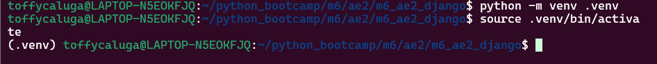
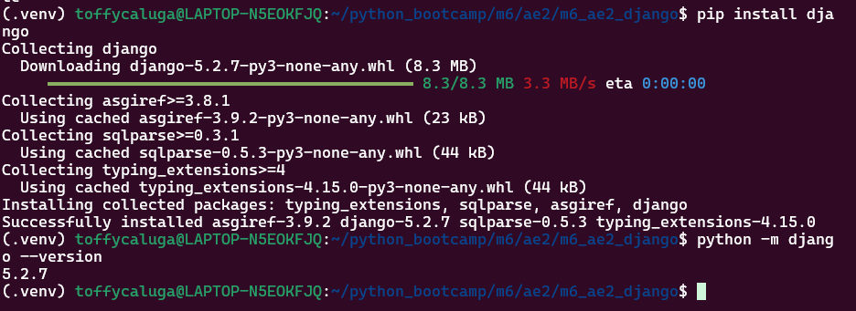
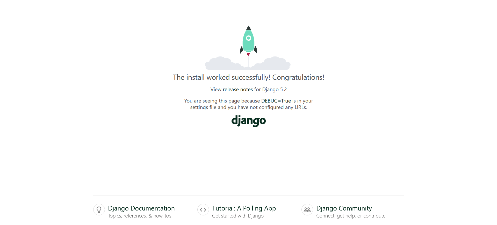
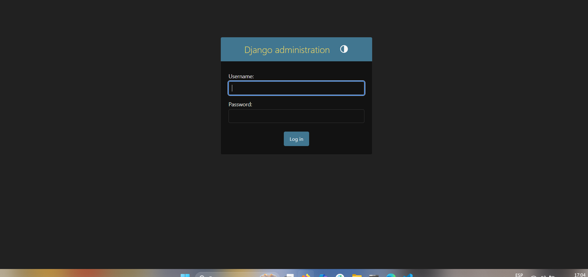
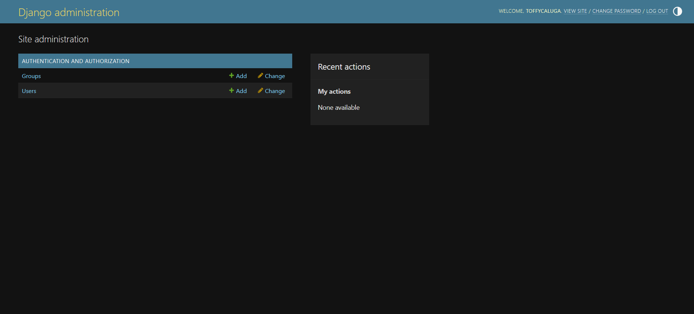

# M6_AE2_ABP — Informe de Instalación y Primer Proyecto en Django

## 1) Instalación de Django (pip + entorno virtual)

**¿Qué es ``pip`` ?**

- pip es el gestor de paquetes de Python. Sirve para instalar, actualizar y desinstalar librerías (como Django) desde el Python Package Index (PyPI).
- Siempre se usa dentro de un **entono virtual** para aislar dependencias del sistema.

```bash
pip --version
```


## 2) Crear entorno virtual e instalar Django 

```bash
# Crear venv
python -m venv .venv

# Activar venv
source .venv/bin/activate   # verás (.venv) al inicio de tu prompt
```

```bash 

# Instalar Django (versión LTS actual estable; si no te exigen versión fija, usa la última)
pip install django

# Verificar
python -m django --version

```


## 3) Crear proyecto Django

```bash
django-admin startproject config .
```


## 4) Explorar archivos clave

- **config/settings.py**: configuración del proyecto (apps, middleware, DB, templates, etc.).

- **config/urls.py**: enrutador principal; mapea rutas a vistas.

- **config/__init__.py**: marca el directorio como paquete Python; útil para imports.

- **manage.py**: utilidad CLI para ejecutar comandos (runserver, migrate, createsuperuser, etc.).

## 5) Levantar el servidor de desarrollo 

Primero, aplicamos migraciones iniciales (crea tablas base , como auth y admin):

```bash
python manage.py migrate
```

iniciamos el servidor 

```bash
python manage.py runserver
# Captura 3: página de bienvenida de Django ok
# Ctrl + C para detener

```


## 6) Crear superusuario y acceder al admin

```bash
python manage.py createsuperuser
```





## 7) Configuración mínima de Templates y URLs (sin crear app)

- Se crea carpeta ``templates/`` en raíz y una vsta simple usando ``TemplateView`` para no crear una app aún.

```bash 
mkdir -p templates
cat > templates/index.html << 'EOF'
<!DOCTYPE html>
<html lang="es">
<head>
  <meta charset="UTF-8">
  <title>Django OK</title>
</head>
<body>
  <h1>¡Django funcionando!</h1>
  <p>Página inicial usando TemplateView y carpeta templates/ propia.</p>
  <p><a href="/admin/">Ir al Admin</a></p>
</body>
</html>
EOF

```
### Editar ``config/settings.py`` -> TEMPLATES.DIRS

Buscamos el bloque ``TEMPLATES`` y ajustamos ``DIRS``

```python
# config/settings.py (fragmento)
TEMPLATES = [
    {
        'BACKEND': 'django.template.backends.django.DjangoTemplates',
        # Añade la carpeta templates en el BASE_DIR
        'DIRS': [BASE_DIR / 'templates'],
        'APP_DIRS': True,
        'OPTIONS': {
            'context_processors': [
                'django.template.context_processors.debug',
                'django.template.context_processors.request',
                'django.contrib.auth.context_processors.auth',
                'django.contrib.messages.context_processors.messages',
            ],
        },
    },
]

```


### Editar ``config/urls.py`` para usar ``TemplateView``:
```python
# config/urls.py
from django.contrib import admin
from django.urls import path
from django.views.generic import TemplateView

urlpatterns = [
    path('admin/', admin.site.urls),
    path('', TemplateView.as_view(template_name='index.html'), name='home'),
]
```