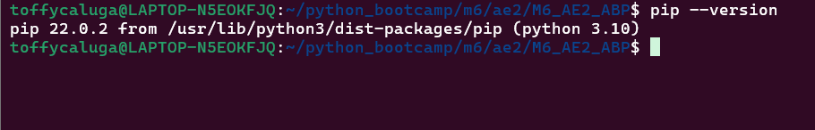

# M6_AE2_ABP — Informe de Instalación y Primer Proyecto en Django

## 1) Instalación de Django (pip + entorno virtual)

**¿Qué es ``pip`` ?**

- pip es el gestor de paquetes de Python. Sirve para instalar, actualizar y desinstalar librerías (como Django) desde el Python Package Index (PyPI).
- Siempre se usa dentro de un **entono virtual** para aislar dependencias del sistema.

```bash
pip --version
```
